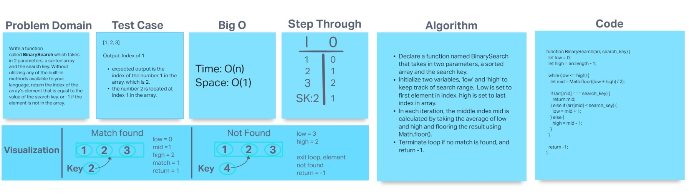

# Challenge Title:  Array-Binary-Search

Write a function called `BinarySearch` which takes in 2 parameters: a sorted array and the search key. Without utilizing any of the built-in methods available to your language, return the index of the array's element that is equal to the value of the search key, or -1 if the element is not in the array.

## Whiteboard Process



## Approach & Efficiency

Approach: Implement the binary search algorithm by setting the low and high pointers to the start and end of the array respectively. In each iteration, calculate the middle index, compare the middle element with the search key, and update the pointers accordingly until a match is found or the search range is exhausted.

Efficiency: Binary search has a time complexity of O(log n) as it efficiently narrows down the search range by half in each iteration.

## Solution

```
function BinarySearch(arr, search_key) {
  let low = 0;
  let high = arr.length - 1;

  while (low <= high) {
    let mid = Math.floor((low + high) / 2);
    if (arr[mid] === search_key) {
      return mid;
    } else if (arr[mid] < search_key) {
      low = mid + 1;
    } else {
      high = mid - 1;
    }
  }
  return -1;
}
```

To run the code and ensure the solution works, follow these instructions:

1. Copy the provided code into a JavaScript environment, such as a JavaScript editor or browser console.

2. Define a sorted array and a search key for testing purposes. For example:

```
const arr = [1, 3, 5, 7, 9];
const searchKey = 5;
```

3. Call the BinarySearch function with the arr and searchKey as arguments, and store the result in a variable. For example:

```
const result = BinarySearch(arr, searchKey);
```

4. Check the value of result. If the search key is found in the array, result will be the index of the element. If the search key is not found, result will be -1. For example:


```
if (result === -1) {
  console.log("Element not found in the array.");
} else {
  console.log(`Element found at index ${result}.`);
}
```

By following these instructions, you can execute the code and verify the functionality of the binary search solution.


## Collaborators

Collaborated with Kao S., Coriana W, and Hayden C.
